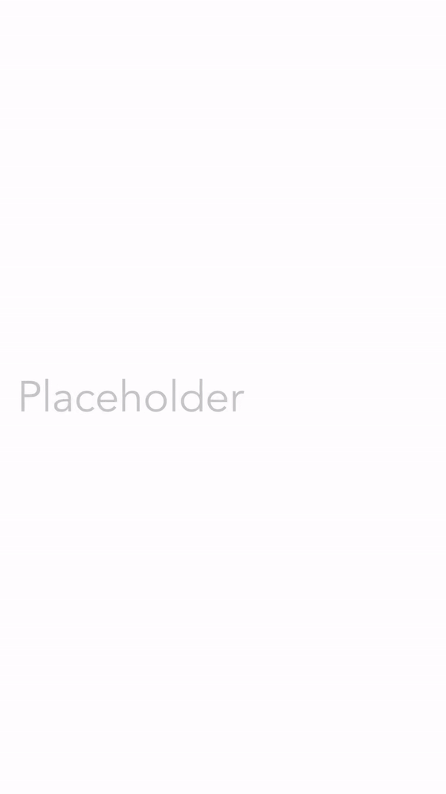

<h1 align="center"> iTextField ⌨️</p>
<h3 align="center"> A fully-wrapped `UITextField` that works entirely in SwiftUI. 🦅 </h3>
<p align="center">
    <strong><a href="#get-started">Get Started</a></strong> |
    <strong><a href="#examples">Examples</a></strong> |
    <strong><a href="#customize">Customize</a></strong> |
    <strong><a href="#install">Install</a></strong> | 
    <strong><a href="#usage">Usage</a></strong>
</p>
<p align="center">
    
</p>

<br/>


## Get Started

1. [Install](https://github.com/benjaminsage/iTextField/blob/master/INSTALL.md) `iTextField`
2. Add `iTextField` to your project
```swift
import SwiftUI
import iTextField

struct ContentView: View {
    @State var text: String = ""

    var body: some View {
        iTextField("Placeholder", text: $text)
    }
}
```
3. Customize your `iTextfield`


## Examples
### Starter

Customize your text field with built-in modifiers.

```swift
import SwiftUI
import iTextField

struct ContentView: View {
    @State var text: String = ""

    var body: some View {
        iTextField("Placeholder", text: $text)
            .accentColor(.purple)
            .fontFromUIFont(UIFont(name: "Avenir", size: 40))
            .keyboardType(.URL)
            .returnKeyType(.done)
            .disableAutocorrection(true)
            .autocapitalization(.none)
            .padding()
    }
}
```

### Jump text fields
Use the optional `isEditing` binding parameter to programmatically jump between text fields.
```swift
import SwiftUI
import iTextField

struct ContentView: View {
    @State var text1: String = ""
    @State var text2: String = ""
    @State var isSecondEditing: String = ""

    var body: some View {
        iTextField("First", text: $text1)
            .onReturn { isSecondEditing = true }
        iTextField("Second", text: $text2,
                   isEditing: $isSecondEditing)
    }
}
```


## Customize
`iTextField` has two required parameters: 1️⃣ a placeholder and 2️⃣ a `text` state. You can optionally pass in a 3️⃣rd an `isEditing` binding if you would like to programmatically focus or unfocus the text field.

iTextField also supports a variety of modifiers.

**Example**: Change the foreground color, accent color, and text alignment with the following code block:
```swift
iTextField("Placeholder", text: $text, isEditing: $isEditing)
    .foregroundColor(.purple)
    .accentColor(.green)
    .multilineTextAlignment(.leading)
```

Use this exhaustive input list to customize your text field.

Modifier | Description
--- | ---
`.fontFromUIFont(_ font: UIFont?)` | Modifies the text field’s **font** from a `UIFont` object. 🔠
`.foregroundColor(_ color: Color?)` | Modifies the **text color** 🎨 of the text field.
`.accentColor(_ accentColor: Color?)` | Modifies the **cursor color** 🌈 of the text field
`.multilineTextAlignment(_ alignment: TextAlignment)` | Modifies the **text alignment** of a text field. ↔️
`.textContentType(_ textContentType: UITextContentType?)` | Modifies the **content type** of a text field. 📧 ☎️
`.disableAutocorrection(_ disable: Bool?)` | Modifies the text field’s **autocorrection** settings.
`.keyboardType(_ type: UIKeyboardType)` | Modifies the text field’s **keyboard type**. 📩
`.autocapitalization(_ style: UITextAutocapitalizationType)` | Modifies the text field’s **autocapitalization** style. 🔡
`.returnKeyType(_ type: UIReturnKeyType)` | Modifies the text field’s **return key** type. ✅
`.isSecure(_ isSecure: Bool)` | Modifies the text field’s **secure entry** settings. 🔒
`.clearsOnBeginEditing(_ shouldClear: Bool)` | Modifies the **clear-on-begin-editing** setting of a text field. ❌
`clearsOnInsertion(_ shouldClear: Bool)` | Modifies the **clear-on-insertion** setting of a text field. 👆
`.showsClearButton(_ showsButton: Bool)` | Modifies whether and when the text field **clear button** appears on the view. ⭕️ ❌
`.passwordRules(_ rules: UITextInputPasswordRules)` | Modifies the text field's **password rules** 🔒. Sets secure entry to `true`.
`.spellChecking(_ spellChecking: Bool? = nil)` | Modifies whether the text field should check the user's **spelling**.
`.smartDashes(_ smartDashes: Bool? = nil)` | Modifies whether the text field includes **smart dashes**.
`.smartInsertDelete(_ smartInsertDelete: Bool? = nil)` | Modifies whether the text field uses **smart insert-delete**.
`.smartQuotes(_ smartQuotes: Bool? = nil)` | Modifies whether the text field uses **smart quotes**.
`.disabled(disabled: Bool)` | Modifies whether the text field is **disabled**. ✋
`.onEditingBegan(perform action: { code })` | Modifies the function called when text editing **begins**. ▶️
`.onEdit(perform action: { code })` | Modifies the function called when the user makes any **changes** to the text in the text field. 💬
`.onEditingEnded(perform action: { code })` | Modifies the function called when text editing **ends**. 🔚
`.onReturn(perform action: { code })` | Modifies the function called when the user presses the **return** key. ⬇️ ➡️
`.onClear(perform action: { code })` | Modifies the function called when the user **clears** the text field. ❌

## Install 
Use the Swift package manager to install. Find instructions [here](https://github.com/benjaminsage/iPages/blob/main/INSTALL.md)😀


## Usage
<b>iTextField is FREE and open-source for individuals, and will remain that way forever. </b>

iTextField is distributed under a GNU GPL open-source license. 

Commercial friends, please note, this license is <b><a href="https://en.wikipedia.org/wiki/GNU_General_Public_License#Legal_barrier_to_app_stores">incompatible for many commercial applications</a></b>. Licenses are available for only $0.99.

<p align="center"><a href="https://general099748.typeform.com/to/p5FtTKBj#package=iTextField">  </a> </p>

